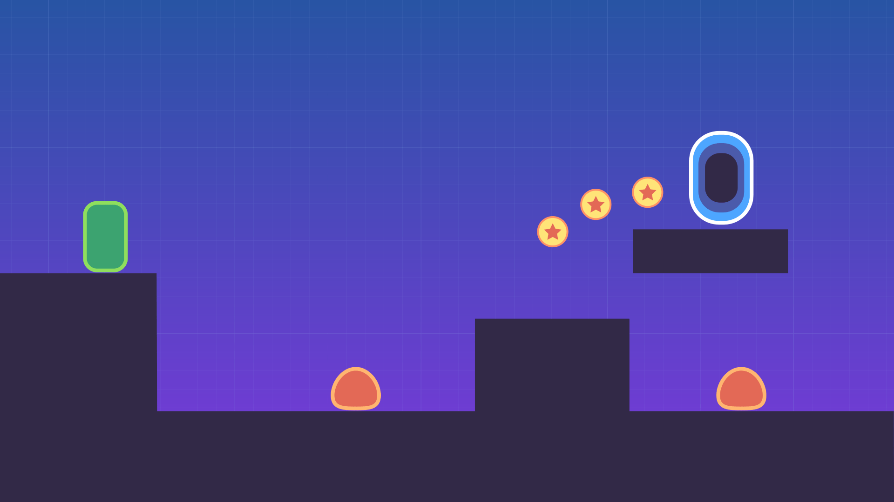

# Your First Game Godot 2d Platformer

This is the complete Open Source Project for our upcoming free beginner Godot 2D Platformer course. It will show you how to create your first Godot game from start to finish.

## What you'll learn ##

- Build a platform game with connected levels, pass through platforms, coins, enemies…
- Design a title screen, pause menu, and score counter
- Learn some good Godot programming practices to keep your projects organized

## Prerequisites ##

- You will need some **basic understanding of GDScript**, which we cover in our [introduction to GDScript](https://www.youtube.com/watch?v=UcdwP1Q2UlU). GDScript is the programming language you will use in Godot to code your games.

We also recommend reading the great [step-by-step guide](http://docs.godotengine.org/en/stable/getting_started/step_by_step/index.html) in the official Godot docs, if you haven't already.

## How to get this free course ##

The course will come out on our YouTube channel at the end of September. To get it, [subscribe to the GDQuest channel](https://youtube.com/c/gdquest) and click the notification bell to know when it is out.

We will also release a free introduction to steering behaviours soon, designed to be beginner-friendly as well!

## Support gdquest ##

This free series is sponsored by our [platformer game creation course](https://gdquest.mavenseed.com).

GDQuest is a social company focused on education and bringing people together around Free Software. 

We share **the techniques professionals use to make games** and open source the code for most of our projects on [our GitHub page](https://github.com/GDquest/).

You can:

- Join the community on [Discord](https://discord.gg/dKUX7m3)
- Follow us on [Twitter](https://twitter.com/NathanGDQuest)
